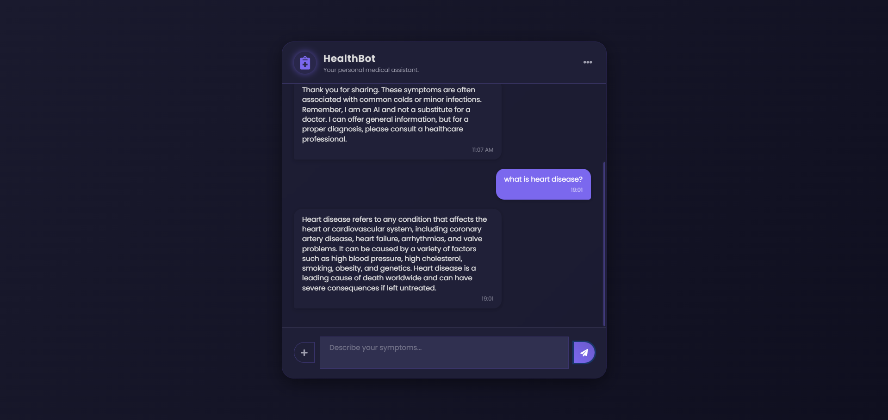

# Medical Chatbot — Llama 2 + RAG with Pinecone


A Flask-based medical question-answering chatbot that uses Retrieval-Augmented Generation (RAG). Documents (PDFs) are embedded using a Sentence Transformers model and stored in Pinecone for semantic search. A local Llama 2 chat model (quantized GGML via ctransformers) generates grounded responses based on retrieved context. The web UI is a simple chat interface built with Bootstrap and jQuery.

Important disclaimer: This project is for research and educational purposes only. It does not provide professional medical advice, diagnosis, or treatment.

## Features
- Retrieval-Augmented Generation over your own medical PDFs
- Local Llama 2 chat model via ctransformers (no external LLM API required)
- Pinecone vector database for fast semantic retrieval
- SentenceTransformers embeddings: all-MiniLM-L6-v2
- Simple and responsive chat UI (Bootstrap + jQuery)
- Easily configurable components (index name, search top-k, model path, temperature, etc.)

## Tech Stack
- Python, Flask
- LangChain (RetrievalQA, PromptTemplate)
- ctransformers (Llama 2 GGML)
- Pinecone (Serverless index)
- sentence-transformers (HuggingFace embeddings)
- pypdf (PDF loading)

## Architecture
1. Ingestion
   - Load PDFs from the data/ directory (src/helper.py: load_pdf)
   - Split into chunks (src/helper.py: text_split)
2. Embedding
   - Embed chunks with HuggingFaceEmbeddings (all-MiniLM-L6-v2)
3. Indexing
   - Create or reuse a Pinecone serverless index
   - Upsert embedded chunks into Pinecone (store_index.py)
4. Retrieval + Generation
   - At query time, retrieve top-k relevant chunks from Pinecone
   - Generate final answer using local Llama 2 model via ctransformers
   - Chain implemented with LangChain RetrievalQA (app.py)
5. UI
   - Flask serves a chat interface (templates/chat.html) that posts to /get

## Prerequisites
- Python 3.9+ (3.10 recommended)
- A Pinecone account and API key
- Ability to download models from Hugging Face
- Sufficient CPU/RAM to run the selected GGML quantized model with ctransformers

## Getting Started

### 1) Clone and create a virtual environment
- Windows (PowerShell):
  ```powershell
  python -m venv .venv
  .\.venv\Scripts\activate
  ```
- macOS/Linux (bash):
  ```bash
  python3 -m venv .venv
  source .venv/bin/activate
  ```

### 2) Install dependencies
```bash
pip install -r requirements.txt
```

### 3) Download the Llama 2 model
- See model/instruction.txt for details
- Example: llama-2-7b-chat.ggmlv3.q4_0.bin from TheBloke on Hugging Face
- Place the file at: model/llama-2-7b-chat.ggmlv3.q4_0.bin

Note: Llama 2 models require acceptance of the Meta Llama License on Hugging Face.

### 4) Configure environment variables
Create a .env file in the project root:
```env
PINECONE_API_KEY=your_pinecone_api_key
```

### 5) Prepare your documents
- Create a data/ directory in the project root
- Place your PDF files in data/

### 6) Build the Pinecone index and ingest documents
```bash
python store_index.py
```
- This will:
  - Create the index medical-chatbot if it does not exist
  - Embed your PDF chunks and upsert them into Pinecone

### 7) Run the application
```bash
python app.py
```
- The app starts on http://0.0.0.0:8080 (localhost:8080)
- Open the URL in your browser and start chatting

## Configuration
You can adjust the following settings in code:
- Pinecone index name
  - store_index.py: index_name = "medical-chatbot"
  - app.py: Uses the same index via a Pinecone client
- Retrieval parameters
  - app.py: retriever=docsearch.as_retriever(search_kwargs={'k': 2})
- LLM configuration
  - app.py: CTransformers model path (model/llama-2-7b-chat.ggmlv3.q4_0.bin)
  - app.py: config={'max_new_tokens': 512, 'temperature': 0.8}
- Chunking
  - src/helper.py: chunk_size=500, chunk_overlap=20
- Server binding
  - app.py: app.run(host="0.0.0.0", port=8080, debug=True)
- Pinecone region (Serverless)
  - store_index.py: ServerlessSpec(cloud="aws", region="us-east-1")

## Project Structure
- app.py — Flask app, RAG chain, chat routes
- store_index.py — Creates/loads Pinecone index and ingests documents from data/
- src/helper.py — PDF loading, text splitting, and embedding helper
- src/prompt.py — Prompt template for RetrievalQA
- templates/chat.html — Web chat interface
- static/style.css — Chat UI styling
- requirements.txt — Python dependencies
- setup.py — Package metadata (used by -e . in requirements)
- model/instruction.txt — How to obtain the Llama 2 GGML model
- research/trials.ipynb — Notebook for experiments (optional)

## How It Works at Runtime
- The client sends a message to /get
- The server queries the Pinecone vector store for similar chunks
- LangChain composes a prompt using the prompt_template and retrieved context
- The local Llama 2 model (ctranformers) generates an answer grounded in the retrieved context
- The UI displays the bot response

## Troubleshooting
- Pinecone API key missing or invalid
  - Ensure .env contains PINECONE_API_KEY and that your account has access
- Index creation/permission errors
  - Check your Pinecone project/region/serverless settings and name uniqueness
- Model not found
  - Verify the GGML file path matches app.py (model/llama-2-7b-chat.ggmlv3.q4_0.bin)
- ctransformers load failure or performance issues
  - Ensure your Python version is supported; try a smaller quant (e.g., q5_k_m vs q4_0) or vice versa
  - Running on CPU; expect higher latency on large models
- Embedding model download issues
  - Confirm internet access and that sentence-transformers can download all-MiniLM-L6-v2
- PDF parsing problems
  - Ensure PDFs are readable; pypdf may fail on malformed PDFs

## Security, Privacy, and Medical Disclaimer
- Do not submit sensitive or personal health information to this demo application
- This software is provided for educational and research purposes only and is not a substitute for professional medical advice, diagnosis, or treatment

## Acknowledgements
- Meta AI for Llama 2
- TheBloke for GGML conversions
- SentenceTransformers and Hugging Face
- LangChain
- Pinecone

## License
No explicit license is provided in this repository. Add a LICENSE file if you intend to open-source this project.
